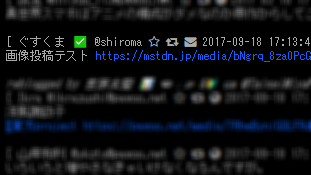

# Tooterminal

## お品書き

- [CiscoIOSとは](#whatis_ios)
- [使い方(基本編)](#howto_first)
  - [基本的な操作感(特権モード)](#howto_global)
  - [インスタンスの登録/ログイン(インスタンスモード)](#howto_instance)
  - [タイムラインを表示する](#howto_termon)
  - [トゥート。画像/動画のアップロード](#howto_toot)
- [使い方(応用編)](#advance)
  - [Tooterminalの設定確認・保存・削除)](#conf_manage)
  - [Tooterminalの設定変更(コンフィギュレーションモード)](#conf_mode)
  - [クライアント名、URLを変更する](#conf_app)
  - [インスタンスログイン、terminal monitorを自動化する](#url_params)
  - [アイコン、サムネ画像、区切り線表示](#conf_status)
  - [正規表現フィルタ](#ins_filter)
  - [便利なキーボードショートカット](#advance_shortcut)

Tooterminalは、jQuery拡張プラグインjQueryTerminalEmulatorPluginを利用して作られたCiscoIOSライクな操作ができるマストドンクライアントです。

完全に俺得マストドンWebクライアントです。

CiscoIOSのコマンド感覚でマストドンしたかったので作りました。

<h1 id="#whatis_ios">CiscoIOSとは</h1>

商用NW機器大手のCisco社製ルーター/スイッチ等で幅広く使われているファームウェアです

ネットワークエンジニアであれば、CCNAの資格取得でCiscoIOSに触れる機会が多いと思います。

強力なタブ補完機能とコマンド省略機能、ドキュメントが無くてもある程度コマンドを探して実行することができる利便性を備えたシステムだと思っています。

当クライアントは、CiscoIOSの操作性を最大限にリスペクトした、[shiroma@mstdn.jp](https://mstdn.jp/@shiroma)が趣味で作成しているcisco_emulator.jsをマストドンクライアントとして実装したものとなっています。

(一応注意書きしときますが、私はCisco社とは無縁の人間です)

<h1 id="#howto_first">使い方(基本編)</h1>

<h2 id="#howto_global">基本的な操作感(特権モード)</h2>

[クライアントページ](http://wd-shiroma.github.io/tooterminal)にアクセスします。

ターミナルが起動したら「?」を押してみると大体どんなコマンドが打てるかわかります。

```
=== CLI画面風 マストドンクライアント "Tooterminal" ===

使い方は"help"コマンドまたは"?"キーを押してください。


Tooterminal# ?
Exec commands:
  show                          情報を表示します。
  instance                      インスタンスモードに移行します。
  delete                        インスタンスの削除をします。
  configure                     アプリケーションの設定を行います
  reload                        画面を再読み込みします。
  clear                         画面を消去します。
  write                         設定をローカルストレージに保存します。
  help                          ヘルプウインドウを表示します。
Tooterminal#
```

もしくはTabを2回押下でコマンド候補が表示されます。

```
Tooterminal# (ここでTab2回)
show    instance    delete    configure    reload    clear    write    help
```

少し文字を入力してから「?」を推すと候補が絞られます

```
Tooterminal# c?
Exec commands:
  configure                     アプリケーションの設定を行います
  clear                         画面を消去します。
```

メインのコマンド入力後、その下の階層のコマンドが出力します。

```
Tooterminal# show ?
Exec commands:
  instances                     全インスタンスの概要を表示します。
  running-configuration         設定されたコンフィグを確認します。
  startup-configuration         保存されたコンフィグを確認します。
  version                       クライアントのバージョンを表示します。
  clock                         現在時刻を表示します。
```

候補に<cr>が出てきたら、コマンドを実行することができます。

```
Tooterminal# show instances ?
Exec commands:
  statistics                    全インスタンスの概要を表示します。
  <instance_name>               指定インスタンスの詳細を表示します。
  <cr>

Tooterminal# show instances
name      | domain                      | scope | username
--------------------------------------------------------------------
jp        | mstdn.jp                    |  rwf  | @shiroma
nico      | friends.nico                |  rwf  | @shiroma
gunma     | gunmastodon.com             |  rwf  | @shiroma
--------------------------------------------------------------------
 登録件数: 3件
```

コマンドは省略して入力することも可能です。

```
Tooterminal# sh ins
name      | domain                      | scope | username
--------------------------------------------------------------------
jp        | mstdn.jp                    |  rwf  | @shiroma
nico      | friends.nico                |  rwf  | @shiroma
gunma     | gunmastodon.com             |  rwf  | @shiroma
--------------------------------------------------------------------
 登録件数: 3件
```

<h2 id="#howto_instance">インスタンスの登録/ログイン(インスタンスモード)</h2>

各インスタンスの登録はグローバルモードからinstanceコマンドを打ちます。

```
Tooterminal# ins jp
Input instance domain: mstdn.jp
New instance registed. enter 'login' and regist your access_token
@mstdn.jp# login
@mstdn.jp#
```

この時点ではインスタンスにアプリケーション登録をしただけの状態です。
アプリケーションの登録が正常に完了すると、各インスタンスの認証画面に遷移します。

")

* 以下の処理はローカルに保存したTooterminalの利用者のみの操作です。 *

-認証コードが表示されるので、コピーして、Tooterminal画面に戻ります。
 -
 -")
 -
 -プロンプトが「Input Authentication Code: 」になっているので、先ほどコピーした認証コードを貼り付けます。
 -
 -```
 -Input Authentication Code: d5a2143be96fb946fc0fc9f5a574be8ba5270e8efe5...
 -Hello! ぐすくま ✅ @shiroma
 -shiroma@mstdn.jp#
 -shiroma@mstdn.jp#
 -```
 -

* ここまで。。。 *

認証が成功したら、プロンプトが「(ユーザ名)@(ドメイン)#」に変わりインスタンスモードに遷移します。

登録したインスタンスを削除する場合はdeleteコマンドを実行します。

```
Tooterminal# del ins jp
Instance "jp" registration will delete! Continue? [confirm] ←ここで確認待ちになるのでEnterを押す
[OK]
Erase of instance: complete
Tooterminal#
```

※アプリケーションを再登録すると、別アプリケーションとして認識されてしまうため、アプリの再登録は極力控えるようにしましょう。

<h2 id="#howto_termon">タイムラインを表示する</h2>

インスタンスモードに遷移した状態ではタイムラインは表示されません。
別途コマンドを入力する必要があります。

```
shiroma@mstdn.jp# ter mon

Streaming start.
[ ぐすくま @shiroma 2017-7-21 18:24:30.514 ] from Tooterminal
テスト

shiroma@mstdn.jp# ter no mon

Streaming closed.
shiroma@mstdn.jp#
```

<h2 id="#howto_toot">トゥート。画像/動画のアップロード</h2>

```
shiroma@mstdn.jp# toot
```


「toot message...」にトゥート内容を記載します。

Toot!ボタンを押下するか、`Ctrl+Enter`でトゥートできます。

投稿枠は`Esc`で非表示にできます。

画像/動画のアップロードは、クリップボードに画像データがある状態で投稿枠で`Ctrl+V`もしくはメディアファイルを投稿枠にドロップすることで出来ます。

貼り付けた画像は対象をクリックすることで添付を取り消すことが出来ます。


<h1 id="#advance">使い方(応用編)</h1>

<h2 id="#conf_manage">Tooterminalの設定確認・保存・削除</h2>

設定はCiscoIOSに倣って、running-configとstartup-configに保存されています。

```
Tooterminal# sh run
{
    "application": {
        "name": "Tooterminal",
        "uris": "urn:ietf:wg:oauth:2.0:oob",
        "scopes": {
            "read": true,
            "write": true,
            "follow": true
        }
    },
    "terminal": {
        "length": 0
    }
}
Tooterminal#
Tooterminal#
Tooterminal# sh start
startup-config is not present
Tooterminal#
```

(sh runの結果がCisco実機と異なります。気分が向いたら合わせるかもしれないです)

running-configはページキャッシュ上のデータなので、startup-config(localStorage)に保存してやる必要があります。(上記はstartup-config未設定)

```
Tooterminal# wri mem
Building configuration...
[OK]
Tooterminal#
Tooterminal# sh start
{
    "application": {
        "name": "Tooterminal",
        "uris": "urn:ietf:wg:oauth:2.0:oob",
        "scopes": {
            "read": true,
            "write": true,
            "follow": true
        }
    },
    "terminal": {
        "length": 0
    }
}
```

設定を初期化する場合は、startup-configのデータを削除して、ページを再読み込みします。

```
Tooterminal# wri era
Erasing the localStorage will remove all configuration files! Continue? [confirm]
[OK]
Erase of nvram: complete
Tooterminal#
Tooterminal#
Tooterminal# reload
```

<h2 id="#conf_mode">Tooterminalの設定変更(コンフィギュレーションモード)</h2>

当クライアントに関する様々な設定はコンフィギュレーションモードに遷移して行います。

※現在未実装コンフィグが多数です。今後少しずつ実装していく予定です。

```
Tooterminal#
Tooterminal# conf t
Tooterminal(config)# ←コンフィギュレーションモードに入った。
```

設定をした後、running-configが変更されていることを確認してください。

※一応日本語も使えますが、入力したコマンドがずれるバグがあります。マルチバイトに完全に対応できてないjQueryプラグインのせいです

※application scopesは設定変更できるようにしてありますが、出来るだけ変更しない方がいいと思います。

<h2 id="#conf_status">アイコン、サムネ画像、区切り線表示</h2>

Tooterminalはデフォルトでアイコン・サムネ画像・区切り線が非表示になっています。



有効にするためにはコンフィギュレーションモードで表示を有効にしてください。

```
Tooterminal# configure terminal
Tooterminal(config)# instances status avatar    ←アイコン表示
Tooterminal(config)# instances status thumbnail ←画像サムネ表示
Tooterminal(config)# instances status separator ←区切り線表示
Tooterminal(config)# exit
Tooterminal# show running-configuration
{
    "application": {
        "name": "Tooterminal",
        "uris": "urn:ietf:wg:oauth:2.0:oob",
        "scopes": {
            "read": true,
            "write": true,
            "follow": true
        }
    },
    "terminal": {
        "length": 0
    },
    "instances": {
        "monitor": "local",
        "status": {
            "avatar": {},  ★☆←アイコンのコンフィグ★☆
            "thumbnail": true, ★☆←画像サムネのコンフィグ★☆
            "separator": true ★☆←区切り線のコンフィグ★☆
        }
    }
}
Tooterminal# write memory   ★☆←再読み込み後に設定が読み込まれるように、セーブしてください。★☆
Building configuration...
[OK]
Tooterminal#
```

変更後、terminal monitorを打つと表示が変わります。


<h2 id="#conf_app">クライアント名、URLを変更する</h2>

Tooterminalのクライアント名はデフォルトで「Tooterminal」となっていますが、コンフィグを設定することにより、クライアント名を変更することが出来ます。

```
Tooterminal# sh run
{
    "application": {
        "name": "Tooterminal",
        "uris": "urn:ietf:wg:oauth:2.0:oob",
        "scopes": {
            "read": true,
            "write": true,
            "follow": true
        }
    },
    "terminal": {
        "length": 0
    }
}
Tooterminal#
Tooterminal# conf t
Tooterminal(config)#
Tooterminal(config)# ?
Exec commands:
  application                   アプリケーション登録に関する設定を行います。
  terminal                      ターミナル表示に関する設定を行います。
  instances                     インスタンス登録の際の雛形設定を行います。
  no                            設定の削除を行います。
  exit                          コンフィギュレーションモードを終了します。
  end                           コンフィギュレーションモードを終了します。
Tooterminal(config)#
Tooterminal(config)# app name OriginalAppName
Tooterminal(config)#
Tooterminal(config)# exit
Tooterminal#
Tooterminal# sh run
{
    "application": {
        "name": "OriginalAppName",
        "uris": "urn:ietf:wg:oauth:2.0:oob",
        "scopes": {
            "read": true,
            "write": true,
            "follow": true
        }
    },
    "terminal": {
        "length": 0
    }
}
```

設定変更後、特権モードにて「instance インスタンス名」コマンドを実行し、新規インスタンス登録を行うと、クライアント名が変更されます。

<h2 id="#url_params">インスタンスログイン、terminal monitorを自動化する</h2>

URLの末尾にパラメータを設定することでインスタンスモードへの自動遷移＆terminal monitorコマンドの自動発行ができます。

`https://wd-shiroma.github.io/tooterminal?instance=インスタンス名&terminal=取得ストリーミング&notification=通知種別`

* インスタンス名
`Tooterminal# instance インスタンス名`で指定した名称
* 取得ストリーミング
home, local, publicを選択できます。
それ以外の文字列が指定された場合はrunning-configの設定値が適用されます。
* 通知種別
表示したい通知種別をカンマ区切りで複数選択できます。(初期値：notification=fav,rev,fol,men)
  * fav: お気に入り
  * reb: ブースト
  * fol: フォロー
  * men: リプライ
  * del: トゥート削除

<h2 id="#ins_filter">正規表現フィルタ</h2>

Tooterminalは公式クライアントと同様に、正規表現フィルタに対応しています。

```
shiroma@mstdn.jp# filter Tooterminal ←「Tooterminal」文字列が含まれるトゥートを表示にします。
shiroma@mstdn.jp# filter /tooterminal/i ←小文字大文字を無視します。
shiroma@mstdn.jp# filter "via sync.twi2mstdn.space" ←空白が含まれる文字列はダブルクォーテーションで括ります。
shiroma@mstdn.jp# no filter ←フィルターを解除します。
```

<h2 id="#advance_shortcut">便利なキーボードショートカット</h2>

TooterminalではCtrl、Alt、Shiftを駆使した様々なショートカットが利用できます。

* Ctrl + D
現在のモードを終了します(exitと同じ)
* トゥートにマウスオーバーして Ctrl + クリック
トゥートをお気に入り登録します。
* トゥートにマウスオーバーして Alt + クリック
トゥートをブーストします。
* トゥートにマウスオーバーして Shift + クリック
トゥートに返信します。
* トゥートにマウスオーバーして ダブルクリック
トゥートのリプライツリーを表示します。
* 投稿画面で Ctrl + Enter
トゥートします。(Tootボタン押下と同様)
* 投稿画面で Esc
投稿ウインドウ、ヘルプウインドウを閉じます。
